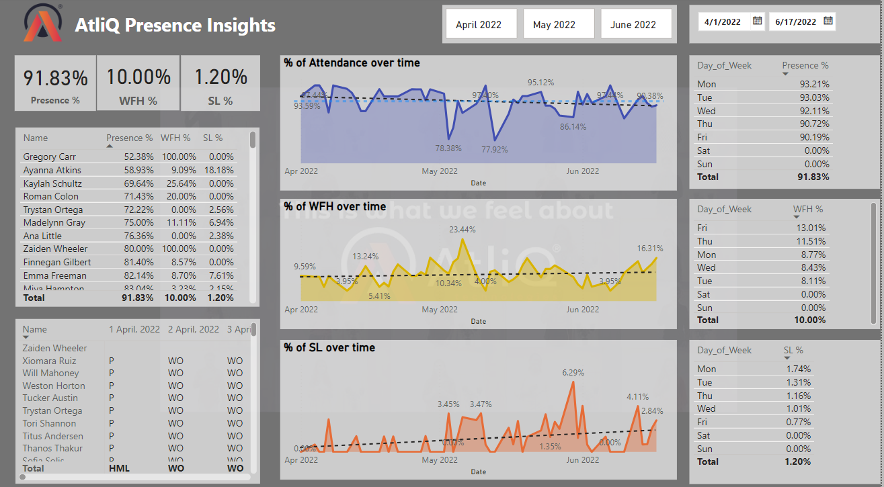
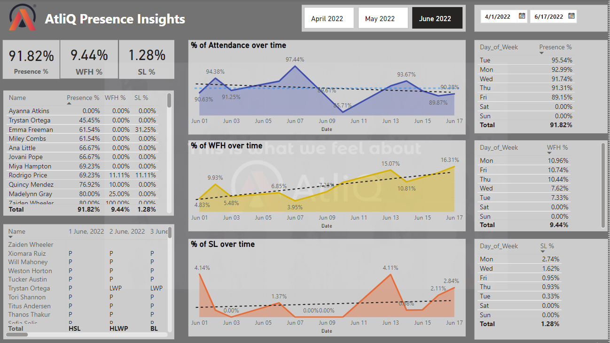

# Data-Analytics-Guided-Project-with-Power-BI

## Inroduction
We will use a real-world dataset from AtliQ Technologies for this end-to-end data analytics project, with an emphasis on employee attendance during a three-month period. In order to assist the HR team in understanding employee attendance trends, we will build a Power BI dashboard. This useful, job-worthy project makes use of real data and provides a hands-on introduction to real-world analytics.

## DataSet

The dataset used in this project is sourced from AtliQ Technologies and contains employee attendance information over a three-month period, from April to June, aligning with the company's fiscal year. This real-world dataset will be analyzed to provide key insights into employee presence and attendance patterns during this three months.

## Key Questions

1. Analyze work-from-home trends, focusing on Mondays and Fridays, to understand employee preferences and possible reasons for this behavior.
2. Calculate the percentage of sick leave taken by employees to provide insights into attendance patterns.

## Process

1. Upload the Excel worksheet to Power BI.
2. Create a template from the data.
3. Process the data (adjust columns, remove unwanted rows).
4. Apply custom functions.
5. Load the final data.
6. Create matrices and measures.
7. Develop visualizations and calculate required percentages.

## Technologies Used

1. Power BI
2. Excel

## Results

## Conclusion

This study shows how data analytics methods may be applied to solve practical business issues. Our goal is to obtain important insights that help improve HR strategies and decision-making procedures by examining employee presence data.

## References

1. YouTube : https://www.youtube.com/@codebasics
2. WebSite : https://codebasics.io/resources/resume-project-data-analytics

## Acknowledgment

Thank you, Hemanand Vadivel, for sharing your expertise in data analysis, Power BI, and dashboarding, and thank you, Dhaval Patel, for organizing this insightful session.
